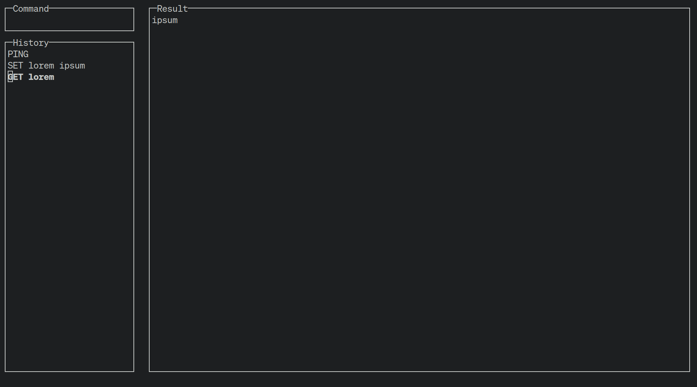
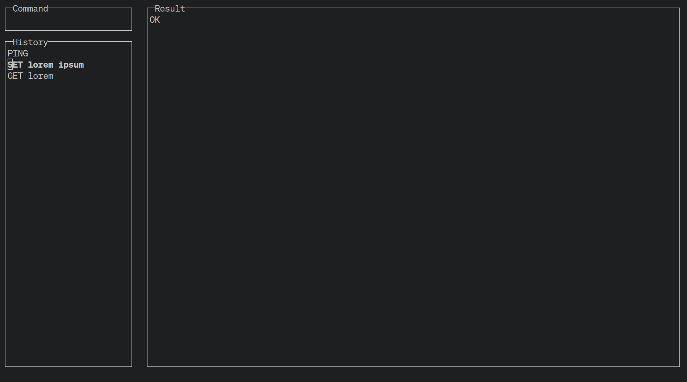

# Redash (W.I.P)

A TUI-client for Redis

<div style="display: flex; gap: 10px;">


</div>

## Prerequisites
- [Rust](https://www.rust-lang.org)

## Usage

```
cargo r -p redash-tui -- --host <REDIS_HOST> --port <REDIS_PORT>
```
